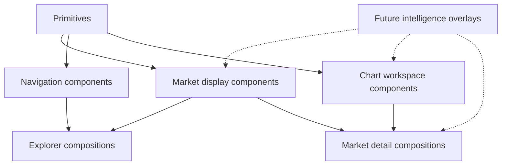

# Probis 2.0 Component System

## Purpose

This document defines the reusable UI architecture for future implementation.
It is a component inventory and behavior contract, not an implementation plan.

The system should support:

- Light and dark themes.
- Mobile-first layouts.
- Dense but readable market discovery.
- Research-oriented detail pages.
- Future intelligence overlays without redesigning the foundation.

## Component Layers

## Primitive Components

Use shadcn/ui primitives as implementation building blocks where suitable.
Keep visual tuning restrained and consistent.

| Component | Responsibility | Notes |
| --- | --- | --- |
| `Button` | Explicit actions | Icon-only for familiar tools; icon and text for primary commands |
| `IconButton` | Compact tools | Requires tooltip and accessible label |
| `Input` | Search and numeric filters | Stable height across surfaces |
| `Select` | Sort, venue, status | Use when option count is manageable |
| `Sheet` | Mobile filters and venue selection | Replaces desktop sidebar behavior |
| `Tabs` | Research workspace sections | Horizontally scrollable on mobile |
| `Tooltip` | Context and metric definitions | Never required for essential understanding |
| `Badge` | Status and compact semantics | Restrained size; avoid decorative badge overload |
| `Skeleton` | Loading structure | Mirror final layout dimensions |
| `Separator` | Section rhythm | Prefer subtle dividers over floating containers |
| `EmptyState` | Honest absence of data | Explain what is missing and offer a useful next action |

## Navigation Components

| Component | Responsibility | Variants |
| --- | --- | --- |
| `AppHeader` | Wordmark, global search, venue context, theme control, watchlist entry | Desktop, mobile |
| `GlobalSearch` | Direct market search from any screen | Inline desktop, focused mobile |
| `VenueSelector` | Provider context switching | Popover, sheet, landing list |
| `ExplorerSidebar` | Desktop filters and category shortcuts | Expanded, collapsed |
| `MobileBottomNav` | Core mobile destinations | Explore, Categories, Search, Watchlist |
| `BreadcrumbTrail` | Detail-page location context | Compact |
| `BackToResults` | Restore previous explorer state | Text and arrow icon |
| `CategoryNavigation` | Category shortcuts | Sidebar list, horizontal chips |

## Discovery Components

### `MarketCard`

Primary visual unit for grid browsing.

Required content:

- Title.
- Venue.
- Category.
- Status.
- Resolution label.
- Top two outcome rows.
- Volume.
- Liquidity when present.
- Updated time.

Optional content:

- Sparkline when probability history exists.
- Future meaningful signal indicator.

Variants:

- Standard grid card.
- Compact mobile card.
- Featured landing card.

Rules:

- Fixed internal rhythm so metrics do not shift when values change.
- No full descriptions.
- No nested cards.
- Entire card is navigable, while secondary controls remain distinct.

### `MarketListRow`

Dense comparison unit for desktop explorer and search results.

Columns:

- Market.
- Venue/category.
- Primary probability.
- Volume.
- Liquidity.
- Open interest.
- Resolution.
- Updated.

Variants:

- Desktop table row.
- Compact mobile result row.

### `MarketOutcomeRow`

Reusable outcome presentation.

Content:

- Outcome label.
- Probability.
- `ProbabilityBar`.
- Outcome volume when relevant.

Variants:

- Card compact.
- Detail summary.
- Outcome-table row.

### `ProbabilityBar`

Visual probability encoding.

Rules:

- Length communicates probability.
- Text always remains readable.
- Use semantic outcome color, not generic success or failure.
- Exact edge values remain honestly formatted.
- Do not animate on first render in a distracting way.

### `CategoryChip`

Compact category affordance for filtering and context.

Variants:

- Static label.
- Selectable filter.
- Removable active filter.

### `VenueBadge`

Small venue identity marker. Keep provider branding restrained so title and
outcome remain primary.

### `StatusBadge`

Status vocabulary:

- Open.
- Paused.
- Closed.
- Resolved.
- Archived.

Avoid using urgent colors for ordinary lifecycle states.

### `ResolutionLabel`

Formats end-date context:

- Date for general browsing.
- Relative label such as `Ends in 2d` when useful.
- `Resolution date unavailable` when missing.

### `MarketMetric`

Small labeled value for volume, liquidity, open interest, and updated time.

Variants:

- Card compact.
- Detail strip.
- List cell.

## Explorer Composition Components

| Component | Responsibility |
| --- | --- |
| `ExplorerHeader` | Title, result count, active venue, compact description |
| `ExplorerToolbar` | Search state, sort, view mode, mobile filter trigger |
| `FilterPanel` | Desktop filter groups |
| `FilterSheet` | Mobile filter groups |
| `ActiveFilterBar` | Removable chips and clear-all action |
| `ViewModeControl` | Grid/list segmented control |
| `SortControl` | Active ordering |
| `MarketGrid` | Responsive card layout |
| `MarketList` | Dense comparison layout |
| `MarketResultsEmptyState` | No-result guidance |
| `PaginationControl` | Bounded paging |

## Market Detail Components

| Component | Responsibility |
| --- | --- |
| `MarketDetailHeader` | Title, venue, category, lifecycle, resolution, updated time |
| `OutcomeSummary` | Primary binary or ranked multi-outcome presentation |
| `MarketMetricsStrip` | Volume, liquidity, open interest, resolution |
| `ResearchTabs` | Overview, Probability, Volume, Open Interest, Outcomes, future tabs |
| `MarketDescription` | Description and resolution context |
| `OutcomesTable` | Ranked outcomes with probability bars and metrics |
| `DataAvailabilityNotice` | Explains absent provider values |
| `RelatedMarketsSlot` | Reserved lightweight related-market area for later phases |

## Chart Components

### `ChartContainer`

Shared chart frame:

- Title.
- Latest value.
- Time-range selector.
- Optional outcome selector.
- Loading state.
- Empty state.
- Chart canvas area.

Do not frame every chart as a decorative floating card. Use a clear section
boundary and stable dimensions.

### `ProbabilityChart`

- Line chart with subtle fill.
- Percentage axis.
- Hover crosshair.
- Timestamp tooltip.
- Outcome selector for multi-outcome markets.

### `VolumeChart`

- Vertical bars.
- Currency formatting.
- Spike-readable scale.
- Timestamp tooltip.

### `OpenInterestChart`

- Line or area chart.
- Currency or contract formatting based on normalized semantics.
- Provider-availability empty state.

### `ChartTooltip`

Unified tooltip:

- Timestamp.
- Series label.
- Formatted value.
- Optional comparison value.

### `TimeRangeSelector`

Segmented control:

- `1D`
- `1W`
- `1M`
- `ALL`

Only enable ranges supported by available history.

### `CandlestickChartSlot`

Reserved future mode. It remains inactive until valid OHLC data exists.

## Landing Components

| Component | Responsibility |
| --- | --- |
| `LandingSearch` | Primary market-finding action |
| `FeaturedMarkets` | Small current market set |
| `CategoryBrowseGrid` | Category discovery entry points |
| `VenueBrowseRow` | Provider context entry |
| `RecentlyUpdatedMarkets` | Fresh market discovery |

Landing sections should be unframed bands or clean layouts rather than a stack
of floating cards.

## Search Components

| Component | Responsibility |
| --- | --- |
| `SearchResultsHeader` | Query and result count |
| `SearchShortcutMatches` | Category and venue matches |
| `SearchResultList` | Market result rows |
| `SearchEmptyState` | Suggestions and filter reset |

## Future Intelligence Extension Slots

These interfaces reserve composition space only. Do not implement them until
their phases begin.

| Future component | Plug-in location | Phase |
| --- | --- | --- |
| `SignalIndicator` | Market card and row | UI-4 |
| `SignalAnnotations` | Chart overlay | UI-4 |
| `SignalsTab` | Market detail tabs | UI-4 |
| `SmartMoneyIndicator` | Market card and row | UI-5 |
| `WalletFlowSummary` | Market detail workspace | UI-5 |
| `SmartMoneyTab` | Market detail tabs | UI-5 |
| `NarrativeChip` | Explorer card and category surfaces | UI-6 |
| `NarrativeSummary` | Market detail workspace | UI-6 |
| `NarrativesTab` | Market detail tabs | UI-6 |
| `RegimeBadge` | Market row and detail overview | UI-7 |
| `RegimeTransitionMarker` | Chart overlay | UI-7 |
| `CrossMarketContext` | Detail related-markets area | UI-7 |

## Component State Rules

Every data-driven component defines:

- Loading state.
- Populated state.
- Empty state.
- Partial-data state.
- Error state.

Partial data is normal:

- A market can have outcomes without history.
- A market can have volume without liquidity.
- Open interest may be unavailable.
- A market can be open without a known end date.

Components should degrade locally. One missing metric must never blank an
entire market card or detail page.

## Accessibility Rules

- All interactive controls receive visible focus states.
- Icon-only controls receive tooltips and accessible labels.
- Probability is expressed as text as well as color and bar length.
- Charts include textual current values and summaries.
- Touch targets remain comfortable on mobile.
- Tables preserve readable semantics and become stacked rows when necessary.
- Color is never the only signal for lifecycle or metric meaning.

