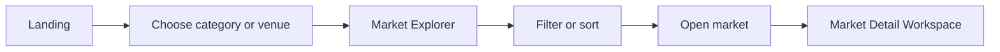
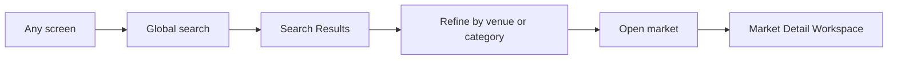
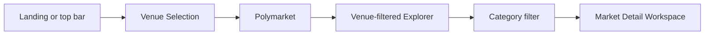
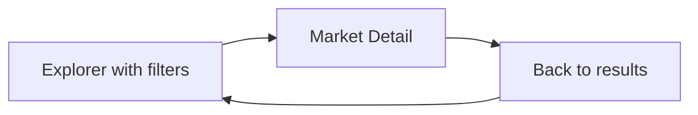

# Probis 2.0 Navigation Map

## Purpose

Probis 2.0 is a prediction-market explorer first. Navigation should help a
user move from broad curiosity to a specific market in a few deliberate steps.
It should feel closer to a modern research product than an operational
dashboard.

This document defines information architecture only. It does not prescribe
route implementation.

## Screen Hierarchy

```text
Probis 2.0
|
+-- Landing
|   +-- Featured markets
|   +-- Category entry points
|   +-- Venue entry points
|   +-- Search entry
|
+-- Venue Selection
|   +-- Polymarket
|   +-- Kalshi (future)
|
+-- Market Explorer
|   +-- All active markets
|   +-- Venue-filtered markets
|   +-- Category-filtered markets
|   +-- Search and filter states
|
+-- Category Explorer
|   +-- Category overview
|   +-- Active category markets
|   +-- Adjacent categories
|
+-- Search Results
|   +-- Relevant markets
|   +-- Category matches
|   +-- Venue matches
|
+-- Market Detail
|   +-- Overview
|   +-- Probability
|   +-- Volume
|   +-- Open Interest
|   +-- Outcomes
|   +-- Reserved intelligence tabs
|
+-- Watchlist
    +-- Future placeholder
```

## Global Navigation

### Desktop

Use a compact top application bar and a contextual left sidebar.

Top bar:

- Probis wordmark.
- Primary search input.
- Venue selector.
- Theme control.
- Watchlist placeholder entry.

Left sidebar:

- `Explore`
- `Categories`
- `Venues`
- Category shortcuts based on available data.
- Collapsible advanced filter area when inside the explorer.

The sidebar is contextual rather than a permanent dashboard menu. On landing
and market detail it should be slimmer. On the explorer it becomes the main
filter surface.

### Mobile

Use a compact top bar:

- Probis wordmark.
- Search icon.
- Theme control.

Use a bottom navigation bar:

- Explore
- Categories
- Search
- Watchlist

Venue and filter controls open as sheets. Search opens a focused full-screen
search mode.

## Conceptual Destination Map

| Destination | Purpose | Primary entry points | Persistent state |
| --- | --- | --- | --- |
| Landing | Orient and accelerate discovery | Product root | None |
| Venue Selection | Choose provider context | Top bar, landing venue row | Selected venue |
| Market Explorer | Browse and compare markets | Landing, categories, venue selection, search | Venue, category, status, sort, view mode |
| Category Explorer | Understand a category and enter its markets | Sidebar, landing categories | Selected venue |
| Search Results | Find markets quickly | Global search | Search query, venue filter |
| Market Detail | Research one market | Any market card or row | Previous explorer state |
| Watchlist | Future saved-market surface | Top bar, mobile nav | Future account state |

Implementation may express these destinations as URL paths and query
parameters later. Filter and sort state should be linkable so users can return
to a useful explorer view.

## Primary User Flows

### Flow A: Discover A Market



### Flow B: Search Directly



### Flow C: Explore A Venue



### Flow D: Return To Research Context



The back action should preserve venue, category, search query, sort, and view
mode. This matters more than adding extra navigation affordances.

## Screen Responsibilities

### Landing

The landing screen is an active product surface, not a marketing page. It
should immediately expose:

- Search.
- Active venue selection.
- A compact set of featured or recently updated markets.
- Category entry points.
- A clear path into the full explorer.

Avoid decorative hero sections, oversized claims, and product-tour cards.

### Venue Selection

Venue selection establishes data context.

- Polymarket is active initially.
- Kalshi is visible only as a restrained future state when appropriate.
- Each venue entry can show market count and update freshness later.
- Venue selection should never feel like a blocking onboarding step.

### Market Explorer

This is the core product screen. It supports rapid scanning, filtering,
sorting, and opening a market workspace. See `PROBIS2_UX_ARCHITECTURE.md`.

### Category Explorer

This screen gives category-level orientation:

- Category name.
- Market count.
- Active versus resolved distribution when available.
- Recently updated markets.
- Market explorer entry with category preselected.

It should remain lightweight. It is a discovery layer, not an analytics
dashboard.

### Search Results

Search results prioritize matching markets. Results should expose enough
context to disambiguate similarly named markets:

- Market title.
- Venue.
- Category.
- Status.
- Top outcomes.
- Resolution date.

Category and venue matches may appear as compact shortcuts above market
results.

### Market Detail

Market detail is a focused research workspace. It supports analytical reading
without requiring a dense dashboard layout. See `PROBIS2_UX_ARCHITECTURE.md`.

### Watchlist

Reserve a navigation entry only. Before persistence and account behavior are
designed, the placeholder should be quiet and honest:

- Empty saved-markets state.
- No fake watchlist counts.
- No disabled controls scattered across market cards unless the interaction is
  clearly marked as upcoming.

## Navigation Rules

1. Search remains reachable from every screen.
2. A market is never more than two interactions away from the explorer.
3. Returning from detail restores the previous explorer state.
4. Venue context is persistent but easy to change.
5. Categories accelerate discovery without becoming a nested navigation maze.
6. Future intelligence destinations remain subordinate to market research.
7. Mobile navigation favors task switching; desktop navigation favors
   comparison and scanning.

