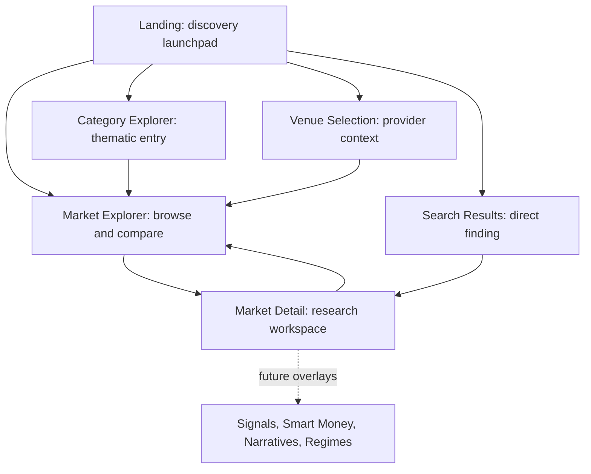

# Probis 2.0 Product Experience Architecture

## Product Position

Probis 2.0 is a modern prediction-market explorer. It begins with Polymarket
and leaves a clear path for future venues such as Kalshi.

The initial experience is intentionally narrower than the archived
intelligence product:

- Discover markets.
- Compare outcomes.
- Inspect price and activity history.
- Understand resolution context.
- Move through research quickly.

Signals, wallet intelligence, narratives, and regimes return later as
contextual overlays. They should enrich the explorer without turning it into a
traditional dashboard.

## Experience Principles

1. Light theme is the default.
2. Dark mode is a first-class alternative.
3. Mobile layouts are designed alongside desktop layouts.
4. Dense information is organized through hierarchy, not hidden behind
   excessive cards.
5. Search and category discovery should feel immediate.
6. Market detail should feel like a research workspace.
7. Outcome probabilities remain the central visual language.
8. Missing provider data produces honest empty states, never invented metrics.

## Product Surface Overview



## Landing Blueprint

Landing is the first useful product screen. It is not a marketing page.

### First Viewport

- Compact application bar with wordmark, search, venue context, and theme
  control.
- Prominent search field with restrained supporting label.
- Featured or recently updated markets in a horizontal or responsive grid.
- Category shortcuts visible below the initial market set.
- A direct `Explore all markets` action.

### Lower Sections

- Browse by category.
- Browse by venue.
- Recently updated markets.
- Future watchlist prompt only when the saved-market feature is ready.

### Avoid

- Oversized hero copy.
- Marketing statistics without product value.
- Empty dashboard metrics.
- Dense sidebar navigation before a user enters exploration.

## Market Explorer Blueprint

The explorer is the core recurring workflow. It should combine the scanning
clarity of a market screener with the approachability of a consumer investing
product.

### Desktop Layout

```text
+------------------------------------------------------------------+
| Top bar: wordmark | search | venue | theme | watchlist            |
+-------------------+----------------------------------------------+
| Context sidebar   | Explorer header: title, count, view controls |
|                   +----------------------------------------------+
| Categories        | Active filter chips                         |
| Status            +----------------------------------------------+
| Resolution window | Sort control | grid/list toggle             |
|                   +----------------------------------------------+
| Advanced filters  | Market result grid or dense result list     |
+-------------------+----------------------------------------------+
```

### Sidebar

Keep filters scan-friendly and collapsible:

- Venue.
- Category.
- Status: open, paused, closed, resolved, archived.
- Resolution timing: ending soon, this week, this month, later.
- Data availability: has probability history, has liquidity, has open
  interest.
- Advanced filters: volume and liquidity ranges when the API supports them.

The initial API supports venue, category, status, and search. Resolution and
metric filters are planned controls and should be activated only after backend
support exists.

### Search

Explorer search should:

- Search title text first.
- Preserve existing filters.
- Debounce input when implemented.
- Reflect the active query visibly.
- Provide an easy clear action.
- Offer a dedicated results experience for global search.

### Sorting

Initial useful sorts:

- Recently updated.
- Resolution date.
- Probability.
- Volume.
- Liquidity.
- Open interest.

Only expose sorts backed by available normalized data. Avoid disabled sort
menus filled with future ideas.

### Grid And List Modes

Grid mode:

- Default on landing and medium-width screens.
- Best for visual discovery and outcome comparison.
- Two to four columns depending on viewport.

List mode:

- Default for dense desktop research and search results.
- Best for comparing metrics across many markets.
- Stable column widths and horizontal overflow handling.

Persist a user's selected view mode locally when implemented.

### Market Card Content

Every `MarketCard` should expose:

- Market title.
- Venue.
- Category.
- Status.
- Resolution date or relative resolution label.
- Top two outcomes with probabilities.
- Compact probability bars.
- Latest volume.
- Latest liquidity when present.
- Updated timestamp.

Optional compact visual:

- A restrained probability sparkline only when snapshot history exists.

### Market List Row Content

Every list row should expose:

- Title.
- Venue and category.
- Primary outcome probability.
- Secondary outcome when useful.
- Volume.
- Liquidity.
- Open interest.
- Resolution date.
- Updated timestamp.

### Hide Until Detail

Keep these out of explorer cards:

- Full descriptions.
- Full outcome tables for multi-outcome markets.
- Full charts.
- Raw snapshot timestamps.
- Long resolution rules.
- Future signal explanations.
- Future wallet-flow summaries.
- Future narrative summaries.

## Category Explorer Blueprint

Category explorer is a lighter discovery surface.

### Structure

- Category header with venue context.
- Active market count.
- Compact category description only if curated copy exists.
- Recently updated markets.
- Markets ending soon.
- `View all` action into the explorer with category applied.
- Adjacent categories as chips.

Use full-width sections rather than nesting cards inside decorative containers.

## Search Results Blueprint

Search results prioritize directness.

### Structure

- Search input remains prominent.
- Query text and result count.
- Venue and category filter chips.
- Category and venue shortcut matches.
- Market results in list mode by default.
- Empty state with clear spelling and filter reset suggestions.

The search surface should not introduce a separate mental model. It is a
focused explorer state.

## Market Detail Blueprint

Market detail is a research workspace with a calm information hierarchy.

### Desktop Layout

```text
+------------------------------------------------------------------+
| Breadcrumb / back to results                                     |
+------------------------------------------------------------------+
| Market title                                  | Status | Venue    |
| Category | resolution date | updated time                         |
| Description or resolution context                                |
+------------------------------------------------------------------+
| Primary probability and outcome summary                           |
+------------------------------------------------------------------+
| Metrics strip: Volume | Liquidity | Open Interest | Resolution    |
+------------------------------------------------------------------+
| Research tabs: Overview | Probability | Volume | Open Interest    |
|                Outcomes | reserved future tabs                    |
+------------------------------------------------------------------+
| Main chart workspace                                             |
+------------------------------------------------------------------+
| Outcome table                                                    |
+------------------------------------------------------------------+
| Description and resolution context                               |
+------------------------------------------------------------------+
| Reserved future intelligence workspace                           |
+------------------------------------------------------------------+
```

### Header

Show:

- Back to previous results.
- Venue.
- Category.
- Status.
- Market title.
- Description excerpt or resolution context.
- End date.
- Latest update timestamp.

### Primary Outcome Summary

For binary markets:

- Lead with explicit `YES` and `NO` labels.
- Show probability, probability bar, and outcome volume where available.
- Avoid relying on array ordering; the backend normalization remains
  label-driven.

For multi-outcome markets:

- Lead with the highest-ranked outcome.
- Show the next outcomes in descending rank.
- Keep all outcomes available in the outcome table.

### Metrics Strip

Use a compact horizontal metric strip:

- Volume.
- Liquidity.
- Open interest.
- Resolution date.

Metrics show `n/a` when unavailable. Tooltips may explain provider
availability.

### Research Tabs

Initial tabs:

- Overview.
- Probability.
- Volume.
- Open Interest.
- Outcomes.

Reserved future tabs:

- Signals.
- Smart Money.
- Narratives.

Regime interpretation belongs in Overview as a future contextual summary, not
as a required primary tab.

### Overview

Overview is the default tab:

- Primary probability chart.
- Compact metrics strip.
- Outcome summary.
- Description and resolution context.
- Volume and open-interest secondary charts only when data exists.

### Probability

- Expanded probability history.
- Outcome selector for multi-outcome markets.
- Time range selector.
- Hover tooltip.
- Honest empty state when snapshot history is sparse.

### Volume

- Expanded volume history.
- Spike-readable vertical scale.
- Time range selector.
- Latest value summary.

### Open Interest

- Expanded open-interest history.
- Time range selector.
- Provider-data availability note when missing.

### Outcomes

- Ranked outcome table.
- Probability bars.
- Latest outcome volume.
- Last updated timestamp.

## Chart Strategy

### Chart Availability Matrix

| Chart | Initial availability | Default placement | Data source |
| --- | --- | --- | --- |
| Probability line chart | Required when history exists | Overview primary chart | Snapshot probability |
| Volume chart | Show when values exist | Overview secondary or Volume tab | Snapshot volume |
| Open interest chart | Show when values exist | Overview secondary or Open Interest tab | Snapshot open interest |
| Candlestick chart | Future optional view | Probability tab mode control | Requires richer normalized price samples |

### Default Chart

Use the probability line chart as the default. Prediction-market users are
primarily asking: what does the market currently believe, and how did that
belief change?

### Probability Chart

- Line chart with subtle area fill.
- Outcome-aware color.
- Current probability in the chart header.
- Time ranges: `1D`, `1W`, `1M`, `ALL` once history supports them.
- Hover crosshair and timestamp tooltip.
- Percentage axis.
- Empty state when there are fewer than two usable samples.

### Volume Chart

- Vertical bars.
- Compact notation for currency.
- Tooltip with timestamp and volume.
- Visually highlight spikes through relative bar height, not decorative
  animation.
- Avoid implying trade-level precision because the foundation stores snapshots.

### Open Interest Chart

- Line or area chart.
- Show only when provider values exist.
- Explain missing values honestly.
- Use currency or contract notation based on normalized provider semantics.

### Candlestick Chart

Reserve this as a future chart mode. The current foundation does not store
open, high, low, and close values, so candles must not be fabricated from
snapshot points. Add it only after a deliberate schema extension or provider
adapter supplies valid candle inputs.

### Chart Interactions

- Hover tooltip.
- Crosshair.
- Responsive resize.
- Time range selection.
- Outcome selection for multi-outcome markets.
- Reset zoom when zoom is introduced later.
- Keyboard-accessible range controls.

Avoid excessive chart controls before the underlying data supports them.

## Mobile Experience

### Explorer

- Single-column market cards by default.
- Compact top bar.
- Sticky filter and sort row.
- Filter sheet for venue, category, status, and future metric filters.
- Grid/list mode can become comfortable card/compact-row mode.
- Search opens a focused full-screen input.

### Market Detail

- Back action remains visible.
- Header stacks naturally.
- Outcome summary appears before secondary metrics.
- Metric strip becomes a horizontally scrollable row or two-column grid.
- Tabs scroll horizontally without wrapping.
- Chart fills available width and uses a stable mobile height.
- Outcome table becomes stacked rows when columns no longer fit.

### Charts

- Keep one chart visible at a time.
- Use larger touch targets for range controls.
- Keep tooltips inside the viewport.
- Avoid tiny axis labels; reduce tick density on narrow screens.
- Allow landscape viewing later only if user demand justifies it.

### Mobile Navigation

Bottom navigation:

- Explore.
- Categories.
- Search.
- Watchlist.

Venue selection and filters use sheets. Detail pages prioritize back navigation
over a persistent bottom bar when vertical space is constrained.

## Future Intelligence Integration

Future intelligence appears as optional context. The market remains useful
when every future module is absent.

### Phase UI-4: Signals Overlay

Explorer:

- Add a compact signal indicator on relevant market cards only.
- Add optional signal-aware sort and filter controls.

Market detail:

- Activate the reserved `Signals` tab.
- Add chart annotations for timestamped signals.
- Add a concise signal summary beneath the primary chart.

### Phase UI-5: Wallet Intelligence

Explorer:

- Avoid raw wallet counts on every card.
- Add a restrained smart-money indicator only for meaningful activity.

Market detail:

- Activate `Smart Money`.
- Add interpreted wallet-flow summaries.
- Add aliased wallet rows with raw address secondary.
- Add relevant chart annotations.

### Phase UI-6: Narratives

Explorer:

- Add optional narrative chips for active themes.
- Support theme-based discovery without replacing categories.

Market detail:

- Activate `Narratives`.
- Add narrative context, related themes, and related markets.
- Phrase correlation carefully and avoid unsupported causality.

### Phase UI-7: Regimes

Explorer:

- Add compact regime badges only when confidence is meaningful.
- Add optional regime filters.

Market detail:

- Add regime summary to Overview.
- Add transition markers to charts.
- Add cross-market regime context in the related-markets area.

## Product Guardrails

- Do not rebuild a dashboard as the default screen.
- Do not place cards inside cards.
- Do not use large decorative sections where a dense research surface belongs.
- Do not make future placeholders louder than live data.
- Do not invent missing probabilities, metrics, or chart points.
- Do not expose raw provider payloads.
- Do not let intelligence overlays obscure the core market question and
  outcomes.

